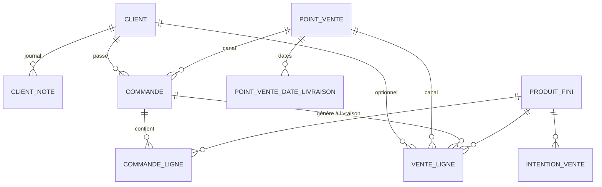

# Spec — Domaine B : Commercial

Spec des **clients** (fiches + historique), **intentions**, **points de vente**, **commandes** (dates de livraison), **ventes**, besoins. Découle de [[00 - Cas d'utilisation]] (UC-B*) et **D8, D9, D10**.

> **Stack** : Next.js 14 · Prisma/MySQL · API REST · webhooks. Consomme Catalogue (A) et Stock (D). Storefront interne (G) pour la saisie marché rapide.

---

## 1. Objet & périmètre

Deux modes de commercialisation complémentaires :

| Mode | Usage | Stock |
|------|--------|-------|
| **Commande + livraison** | Demi-gros, boutique, dépôt… | Déstockage à la **livraison** (`commande` → `livree`) |
| **Vente directe / marché** | Saisie agrégée jour × produit × PdV | Déstockage immédiat à la validation |

**Dans le périmètre**
- **Fiches clients** + **historique** chronologique (commandes, ventes, notes)
- Points de vente / canaux (où l’on vend / livre), avec jours / dates de livraison
- **Commandes** rattachées à un **client** (+ PdV canal) : lignes, `date_livraison`, statuts
- Ventes directes (marché, client optionnel) + ventes issues de commandes livrées
- Intentions globales, réalisé vs intention, besoins matière
- Webhooks `client.*`, `commande.*`, `vente.realisee`

**Hors périmètre**
- Paiement en ligne / boutique publique (D8)
- Facturation PDF / relances comptables (webhooks → module externe)
- CRM avancé (scoring, campagnes mail)
- Réservation ferme de stock à la confirmation
- Répartition mensuelle des intentions

---

## 2. Décisions de conception (Commercial)

| # | Décision |
|---|----------|
| CB-1 | **Intention** = `(produit_fini_id, annee)` unique ; pas de PdV (Q-B4). |
| CB-2 | **Vente directe** = ligne `(date, produit_fini_id, point_vente_id)` agrégée (marché). |
| CB-3 | Prix : défaut catalogue ; surchargeable (commande ou vente). |
| CB-4 | Vente directe : commit = sortie stock + `VenteLigne` ; 409 si insuffisant. |
| CB-5 | CA / marge prévisionnels depuis intentions × prix / revient Catalogue. |
| CB-6 | Besoins matière dérivés des intentions (et optionnellement des commandes confirmées non livrées). |
| CB-7 | **PointVente** = **canal** (ferme, marché, tournée…) : planning livraison + notes. Ce n’est **pas** le client. |
| CB-8 | Annulation vente : restock + statut `annulee`. |
| CB-9 | Opérateur tracé (D14). |
| CB-10 | **Commande** : `client_id` **obligatoire**, `point_vente_id` (canal) obligatoire, **`date_livraison`** obligatoire. |
| CB-11 | Statuts commande : `brouillon` → `confirmee` → `preparee` → `livree` \| `annulee`. |
| CB-12 | **Déstockage à `livree`** : `VenteLigne` liées + sorties stock. |
| CB-13 | Une date de livraison par commande V1. |
| CB-14 | Calendrier : jours habituels PdV et/ou dates ponctuelles ; commandes = vérité opérationnelle. |
| CB-15 | **Fiche Client** distincte : identité, contacts, adresse/livraison, notes, archivage. |
| CB-16 | **Historique client** = vue chronologique dérivée (commandes + ventes + `ClientNote` manuelles). Pas de suppression d’historique. |
| CB-17 | Vente **marché / directe** : `client_id` **optionnel** (anonyme OK) ; `point_vente_id` requis. |

---

## 3. Modèle de données

### 3.0 Client

- `id`, `nom` (unique — raison sociale ou nom d’usage)
- `type` enum : `particulier` | `professionnel` | `association` | `autre` (nullable)
- `contact_nom?`, `email?`, `telephone?`
- `adresse?`, `code_postal?`, `ville?`
- `conditions_livraison?` (texte — accès, créneau préféré…)
- `notes` (texte fiche)
- `archive`, timestamps

**ClientNote** (entrée manuelle d’historique)
- `id`, `client_id`, `date`, `texte`, `operateur_*`, timestamps

### 3.1 PointVente (canal)

- `id`, `nom` (unique)
- `type` : `ferme` | `marche` | `boutique_producteur` | `demi_gros` | `tournee` | `autre`
- `contact` (texte nullable — contact du **lieu/canal**, pas du client)
- `jours_livraison_habituels` (JSON int[])
- `notes`, `archive`, timestamps

**PointVenteDateLivraison** — `(point_vente_id, date)` PK, `notes?`

### 3.2 Commande

- `id`, **`client_id`** (obligatoire), **`point_vente_id`** (canal)
- `date_commande`, **`date_livraison`** (obligatoire)
- `statut` : `brouillon` | `confirmee` | `preparee` | `livree` | `annulee`
- `reference?`, `notes?`, `operateur_*`, timestamps

**CommandeLigne** — `produit_fini_id`, `quantite`, `prix_unitaire`, `montant`, `notes?`

### 3.3 IntentionVente

- `id`, `produit_fini_id`, `annee`
- unique `(produit_fini_id, annee)`
- `unites_visees`, `priorite` P1/P2/P3, `notes?`

### 3.4 VenteLigne

- `id`, `date`, `produit_fini_id`, `point_vente_id`
- `client_id?` (null si vente anonyme marché — CB-17 ; recopié depuis commande à livraison)
- `quantite`, `prix_unitaire`, `montant`
- `statut` : `validee` | `annulee`
- `source` : `directe` | `commande`
- `commande_id?`, `commande_ligne_id?`
- `operateur_*`, `notes?`
- `stock_mouvement_ids`
- timestamps

---

## 4. Règles métier

### 4.0 Fiche & historique client

**Fiche** : CRUD client ; archivage si plus de commandes actives (sinon 409 ou archive soft OK avec historique conservé).

**Historique** `GET /clients/:id/historique?from=&to=` — flux fusionné trié par date décroissante :

| Type | Source |
|------|--------|
| `note` | `ClientNote` |
| `commande` | création / confirmation / livraison / annulation (événements ou snapshot statut) |
| `vente` | `VenteLigne` liées au client |

Chaque entrée : `{ date, type, libelle, montant?, ref_id, notes? }`.

À la livraison d’une commande : les `VenteLigne` portent le `client_id` de la commande → visibles dans l’historique.

### 4.1 Cycle commande

1. **Créer** (`brouillon`) : **client** + canal PdV + `date_livraison` + lignes.
2. **Confirmer** : verrouille l’essentiel ; webhook `commande.confirmee` ; alimente la vue « à préparer / à livrer ».
3. **Préparer** : marquage logistique (picking) ; option UI « vérifier stock » (alerte, pas de sortie).
4. **Livrer** (`livree`) — transaction :
   - pour chaque ligne : `sortirProduitPourVente` + créer `VenteLigne` (`source=commande`, `client_id` recopié, date = `date_livraison` ou date réelle saisie)
   - si stock insuffisant sur une ligne → **409** rollback (livraison partielle V1 = non ; ajuster les quantités avant)
   - webhook `commande.livree` + `vente.realisee`
5. **Annuler** : si non `livree` ; webhook `commande.annulee`.

Replanification : `PUT date_livraison` tant que statut ∈ {brouillon, confirmee, preparee}.

### 4.2 Vente directe (marché)

`POST /ventes` : `point_vente_id` requis ; `client_id` optionnel (CB-17).

### 4.3 Réalisé vs intention

Σ ventes `validee` (directes **et** issues de commandes) sur l’année.

### 4.4 Besoins dérivés

1. Base : intentions (comme avant).
2. **Complément V1** : quantités des commandes `confirmee`\|`preparee` (carnet de commandes).

### 4.5 Calendrier livraisons

`GET /livraisons?from=&to=` : union des `Commande.date_livraison` (+ dates PdV planifiées sans commande = rappel UI).

---

## 5. Écrans (back-office)

Menu **Commercial**.

- **Clients** — liste / recherche ; fiche (coords, notes) ; onglet **Historique** (timeline) ; bouton « Nouvelle commande ».
- **Points de vente** — canaux ; jours / dates livraison.
- **Commandes** — filtre client, PdV, date livraison, statut ; fiche + actions.
- **Calendrier livraisons** — vue mois/semaine.
- **Intentions** — grille année ; synthèse CA/marge.
- **Ventes** — historique (directes + via commande) ; réalisé vs intention.
- **Besoins** — intentions ± carnet commandes.

Storefront (G) : vente directe marché (client optionnel) ; commandes clients surtout back-office.

---

## 6. API REST

| Ressource | Méthodes |
|---|---|
| `/clients` | GET, POST, GET/PUT `:id`, DELETE → archive |
| `/clients/:id/notes` | GET, POST |
| `/clients/:id/historique` | GET `?from=&to=` |
| `/points-vente` | CRUD + archive |
| `/points-vente/:id/dates-livraison` | GET, POST, DELETE |
| `/commandes` | GET `?client_id=&statut=&point_vente_id=&from=&to=`, POST, GET/PUT `:id` |
| `/commandes/:id/lignes` | CRUD sous-ressources (si brouillon/confirmée) |
| `/commandes/:id/confirmer` | POST |
| `/commandes/:id/preparer` | POST |
| `/commandes/:id/livrer` | POST `{ date_livraison_reelle? }` → stock + ventes |
| `/commandes/:id/annuler` | POST |
| `/livraisons` | GET `?from=&to=` |
| `/intentions` | … |
| `/ventes` | GET, POST (directe, `client_id?`), annuler |
| `/ventes/realise-vs-intention` | GET |
| `/besoins` | GET `?annee=&inclure_commandes=` |

---

## 7. Invariants

1. `commande.client_id` et `commande.date_livraison` toujours renseignés.
2. `livree` ⇒ `VenteLigne` avec même `client_id` + sorties stock.
3. Pas de double livraison (409).
4. Intention sans client/PdV ; commande **avec** client + canal.
5. Archivage client : historique conservé ; 409 si commandes non terminées/annulées (option : forcer archive).
6. Produit inactif : pas de nouvelle ligne commande / vente.

---

## 8. Webhooks

| Événement | Payload (clés) |
|---|---|
| `client.cree` / `client.maj` | `id, nom, contact…` |
| `commande.confirmee` | `id, client_id, point_vente_id, date_livraison, lignes[…], notes` |
| `commande.livree` | `id, client_id, point_vente_id, date_livraison, vente_ids[]` |
| `commande.annulee` | `id, client_id` |
| `vente.realisee` | (+ `client_id?`, `commande_id?`, `source`) |
| `vente.annulee` | … |
| `intention.maj` | … |

---

## 9. Découpage plans (indicatif)

1. **B1** — Clients (+ notes) + Points de vente + dates livraison
2. **B2** — Intentions + synthèse
3. **B3** — Commandes (CRUD, statuts, lien client)
4. **B4** — Livrer → stock + ventes + historique client
5. **B5** — Ventes directes + réalisé vs intention + besoins + écrans / calendrier

---

## 10. Hors périmètre / ouvertures

- Facturation PDF / CRM avancé.
- Livraison partielle / multi-dates sur une commande.
- Réservation stock à `confirmee`.
- Import CSV.

---

## Liens

- [[00 - Cas d'utilisation]] · [[01 - Décisions & questions ouvertes]] · [[A - Catalogue (spec)]] · [[D - Stock (spec)]] · (à venir) [[G - Plateforme (spec)]]
