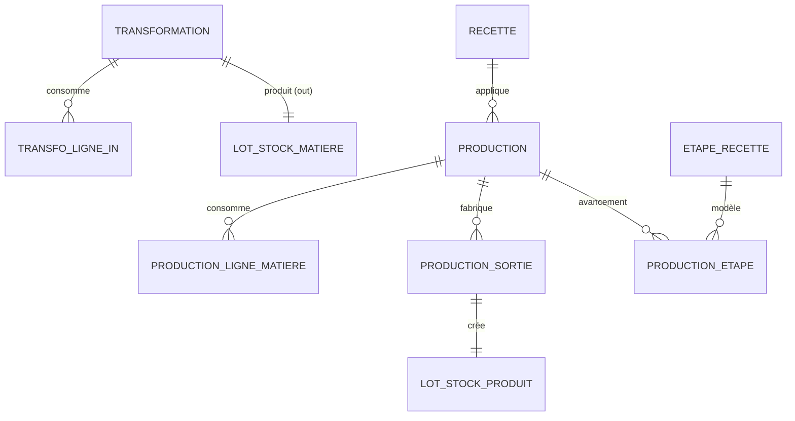

# Spec — Domaine C : Production & transformation

Spec des **transformations primaires** (matière → matière) et des **productions** (recette → produit fini), avec suivi d’avancement et **traçabilité** remontable. Découle de [[00 - Cas d'utilisation]] (UC-C*) et **D14, D15, D18**.

> **Stack** : Next.js 14 · Prisma/MySQL · API REST · webhooks — voir [[AI.md]]. Consomme les services Stock ([[D - Stock (spec)]]) et le Catalogue ([[A - Catalogue (spec)]]).

---

## 1. Objet & périmètre

Deux natures d’opérations **distinctes** (D18) :

| | **Transformation (C0)** | **Production (C1)** |
|--|-------------------------|---------------------|
| Sens | Matière(s) → **autre matière** | Recette (plusieurs matières) → **Produit fini** |
| Exemples | Séchage, distillation, mondage, congélation, torréfaction | Mélanger Herbes de Provence 100 ml, stériliser un sirop… |
| Stock | Sortie lots matière in + entrée lot matière out | Sortie matières + entrée lot(s) produit |

**Dans le périmètre**
- Déclaration transformation + effet stock + webhook
- Déclaration production (échelle recette, conditionnements, n° lot, DLUO, opérateur) + effet stock + webhook
- Contrôle stock insuffisant (409 / alerte avant commit)
- Suivi d’avancement par étapes de recette (C2) + tableau de bord simple
- API de **traçabilité** remontante / descendante (UC-C1.3)

**Hors périmètre**
- Ordonnancement / charge par semaine (Q-C2)
- Création des recettes / équipements (A)
- Ventes (B) · Culture / récoltes (E) sauf lecture traçabilité

---

## 2. Décisions de conception (Production)

| # | Décision |
|---|----------|
| CC-1 | **Transformation ≠ Production** (D18). Pas de « recette » pour le séchage : type d’opération + matières in/out. |
| CC-2 | Transformation V1 : **1..n lignes entrantes** (même matière ou lots différents, ex. plusieurs sacs frais) → **exactement 1 matière sortante**. Pas d’assemblage multi-ingrédients (sinon c’est une Production). |
| CC-3 | **Paramètres** de transformation : JSON libre versionné (`temperature_c?`, `duree_min?`, `humidite?`, `notes?`…) — champs optionnels, pas de schéma figé par type au V1 (tranche Q-C paramètres). |
| CC-4 | **Rendement** transformation = `quantite_sortie / Σ quantites_entree` (même dimension d’unité ; conversion g/kg via couche unités Catalogue si besoin). Affiché + stocké. |
| CC-5 | Production : quantités matières calculées depuis la recette × **facteur d’échelle** (`quantite_sortie_visee / recette.quantite_sortie`), mode proportions ou absolu (A). |
| CC-6 | Une production peut générer **1..n sorties produit** (même recette, conditionnements différents) dans la même déclaration. |
| CC-7 | **N° de lot production** : texte unique par année (ou global) saisi ou proposé (`YYYY-MM-DD-xxx`). Obligatoire. |
| CC-8 | Avancement (C2) : copie des `EtapeRecette` en `ProductionEtape` à la création ; états `a_faire` \| `en_cours` \| `termine`. La production globale : `brouillon` \| `en_cours` \| `terminee` \| `annulee`. **Stock mû uniquement au passage `terminee`** (commit atomique). |
| CC-9 | Goulots V1 : liste des productions `en_cours` + équipements requis des étapes `en_cours` (pas de calendrier d’occupation fine). |
| CC-10 | Traçabilité canonique : **Parcelle → Planche → Récolte → Séchage → Transformation → Produit**. **Séchage** = C0 `type=sechage` (nœud nommé). **Transformation** (dans la chaîne) = **Production C1** vers le produit ; les autres C0 (distillation, mondage…) apparaissent comme nœuds intercalés dans le graphe API. Endpoint dédié, graphe d’IDs. |
| CC-11 | Opérateur tracé (D14) sur transformation et production. |
| CC-12 | **Poids + notes à chaque étape.** Tout nœud opérationnel de la chaîne (récolte, séchage / C0, transformation C1, lot produit) et chaque **étape de procédé** (`ProductionEtape`) porte : `poids_kg` (relevé à cette étape) + `notes` (texte libre). Le poids est **obligatoire** dès qu’une quantité matière/produit est mesurée ; les notes sont toujours saisissables (valeur optionnelle). |
---

## 3. Modèle de données



### 3.1 Transformation

**Transformation**
- `id`, `type` enum : `sechage` | `distillation` | `mondage` | `congelation` | `torrefaction` | `autre`
- `type_libelle` (si `autre`)
- `date` (date opération)
- `parametres` (JSON, CC-3)
- `matiere_out_id` (FK Matiere)
- `poids_kg_out` / `quantite_out` (> 0) — **poids sortant** (CC-12 ; alias stock = quantité dans `unite` matière, en pratique kg pour végétaux)
- `unite_out` (alignée matière out)
- `rendement` (decimal, calculé)
- `emplacement_out_id?`, `date_peremption_out?`
- `lot_stock_matiere_out_id` (rempli au commit)
- `operateur_id` / `operateur_nom`
- `notes` (texte libre, CC-12)
- `statut` : `brouillon` | `terminee` | `annulee`
- timestamps

**TransformationLigneIn**
- `id`, `transformation_id`, `matiere_id`, `lot_stock_matiere_id?`
- `poids_kg` / `quantite` (> 0) — **poids entrant** de la ligne
- `notes` (texte libre par ligne, ex. « sac mouillé »)

Contrainte : toutes les lignes in référencent des matières **différentes de** `matiere_out` (sinon 409) — évite no-op ; le séchage frais→sec = deux matières Catalogue distinctes (CD-2 Stock).

### 3.2 Production

**Production**
- `id`, `recette_id`
- `date`
- `numero_lot` (unique — CC-7)
- `facteur_echelle` (decimal) **ou** `quantite_sortie_visee` + `unite_sortie` (dérive le facteur)
- `poids_kg` (nullable — poids total mélange / lot de production relevé à cette étape, CC-12)
- `date_peremption` (DLUO lot produit — peut être surchargée par sortie)
- `operateur_id` / `operateur_nom`
- `statut` : `brouillon` | `en_cours` | `terminee` | `annulee`
- `notes` (texte libre, CC-12)
- timestamps

**ProductionLigneMatiere** (figée à la validation / au calcul)
- `id`, `production_id`, `matiere_id`, `quantite_requise`, `poids_kg_consomme?` (relevé réel à la pesée)
- `notes?`
- `lot_stock_matiere_ids` / quantités allouées (après commit FIFO ou choix manuel)

**ProductionSortie**
- `id`, `production_id`, `produit_fini_id`
- `quantite_unites` (> 0)
- `poids_kg` (poids net total de la sortie, ou dérivé `quantite_unites × produit.poids_unite` avec surcharge manuelle)
- `notes?`
- `date_peremption?`, `emplacement_id?`
- `lot_stock_produit_id?`

**ProductionEtape** (C2 — chaque étape de procédé)
- `id`, `production_id`, `etape_recette_id?`, `ordre`, `description` (copie)
- `temps_main_oeuvre_prevu_min`, `temps_attente_prevu_min`
- `statut` : `a_faire` | `en_cours` | `termine`
- `poids_kg` (nullable — pesée / contrôle à cette étape, CC-12)
- `notes` (texte libre — observations, écarts, météo atelier…)
- `started_at?`, `finished_at?`
- équipements : copie des ids ou libellés pour affichage goulot

---

## 4. Règles métier

### 4.1 Valider une transformation (`statut → terminee`)

Transaction :
1. Vérifier quantités / matières.
2. `stock.sortirMatiere` pour chaque ligne in (lots imposés ou FIFO).
3. `stock.entrerMatiereDepuisTransformation` pour la sortie.
4. Calculer `rendement`, lier `lot_stock_matiere_out_id`.
5. Webhook `transformation.declaree`.

Échec stock → **409** `STOCK_INSUFFISANT` (rollback).

### 4.2 Cycle de vie production

1. **Créer** (`brouillon` ou `en_cours`) : copie étapes recette → `ProductionEtape` ; calcule lignes matières (échelle) **sans** déstocker.
2. **Prévisualiser stock** : `GET …/besoins` → disponible vs requis (alerte UC-C1.4).
3. Avancer les étapes (C2) tant que non `terminee`.
4. **Terminer** : vérifie stock → sorties matières → entrées produits → statut `terminee` → webhook `production.declaree`.
5. **Annuler** : seulement si pas encore `terminee` (pas de reverse stock auto au V1 ; si déjà terminée → ajustements Stock manuels).

### 4.3 Calcul besoins matières (échelle)

- Mode `proportions` : fractions × masse/volume de lot de référence × facteur.
- Mode `absolu` : quantités lignes × facteur (`quantite_visee / quantite_sortie_recette`).
- Unités via couche Catalogue ; lignes sans coût / non convertibles : production possible mais badge `cout_partiel` (n’bloque pas le stock).

### 4.4 Traçabilité (UC-C1.3 / D15)

Chaîne **canonique** (libellés métier) :

**Parcelle → Planche → Récolte → Séchage → Transformation → Produit**

| Libellé chaîne | Entité technique |
|----------------|------------------|
| Parcelle / Planche | Culture |
| Récolte | `Recolte` (+ sessions / `campagne_id`) |
| **Séchage** | `Transformation` avec `type = sechage` |
| **Transformation** | `Production` (C1, assemblage recette → produit) |
| Produit | `LotStockProduit` / Produit fini |
| (intercalé) | Autres C0 (`distillation`, `mondage`…) entre séchage et production si présents |

**Remonter** depuis `LotStockProduit` :
```
LotStockProduit → Production (« Transformation »)
  → lots matière consommés
      → si source Transformation type=sechage (« Séchage ») → lots frais in
          → Recolte → LotCulture → Planche → Parcelle
      → si autre C0 → … (récursif)
      → si achat → Achat
```

**Descendre** depuis Parcelle / Planche / Récolte : séchages, autres C0, productions aval.

Endpoints : `GET /tracabilite/lots-produit/:id` (arbre JSON avec libellés chaîne) ; `GET /tracabilite/recoltes/:id/aval`.

Chaque nœud de l’arbre expose au minimum `{ poids_kg, notes, date, operateur? }` (CC-12) pour lecture traçabilité.

### 4.5 Tableau de bord (C2)

- Productions `en_cours` (étape courante = première non `termine`, temps restant estimé = Σ temps prévus des étapes restantes).
- « Goulot » : équipements apparaissant sur &gt; N étapes `en_cours` (N = 1 → simple liste de conflits potentiels). Pas de planning ressource.

---

## 5. Écrans (back-office)

Menu **Production**.

- **Transformations** — formulaire avec **poids** + **notes** (lignes in et sortie).
- **Productions** — liste (filtre statut, recette, dates) ; wizard : recette → échelle → sorties produits → DLUO / n° lot → préview stock → créer.
- **Fiche production** — étapes (cocher / démarrer / terminer, **poids** + **notes** par étape), besoins matières, sorties, bouton **Terminer & stocker**.
- **Tableau de bord** — en cours + goulots équipements.
- **Traçabilité** — depuis un lot produit : arbre Parcelle→…→Produit ; chaque nœud affiche **poids** et **notes**.

---

## 6. API REST

| Ressource | Méthodes |
|---|---|
| `/transformations` | GET, POST (brouillon), GET/PUT `:id` |
| `/transformations/:id/terminer` | POST → commit stock + webhook |
| `/transformations/:id/annuler` | POST |
| `/productions` | GET, POST, GET/PUT `:id` |
| `/productions/:id/besoins` | GET → requis vs disponible |
| `/productions/:id/etapes/:etapeId` | PATCH `{ statut, poids_kg?, notes? }` |
| `/productions/:id/terminer` | POST → commit stock + webhook |
| `/productions/:id/annuler` | POST |
| `/production/tableau-bord` | GET |
| `/tracabilite/lots-produit/:id` | GET |
| `/tracabilite/recoltes/:id/aval` | GET |

---

## 7. Invariants

1. Transformation terminée ⇒ lot matière out créé et lignes in entièrement sorties.
2. Production terminée ⇒ toutes sorties produit créées ; matières consommées ≥ requis (tolérance 0 au V1).
3. `produit_fini.recette_id` = `production.recette_id` pour chaque sortie.
4. `numero_lot` unique (409 si collision).
5. Pas de double commit (`terminer` idempotent ou 409 si déjà `terminee`).
6. Opérateur renseigné à la terminaison (D14).

---

## 8. Webhooks

| Événement | Payload (clés) |
|---|---|
| `transformation.declaree` | `id, type, date, lignes_in[{matiere_id, poids_kg, lot_id, notes?}], matiere_out_id, poids_kg_out, rendement, lot_out_id, notes, operateur` |
| `production.declaree` | `id, recette_id, numero_lot, date, poids_kg?, notes, sorties[{produit_fini_id, quantite, poids_kg, lot_produit_id, notes?}], matieres_consommees[{matiere_id, poids_kg, notes?}], operateur, date_peremption` |

---

## 9. Découpage plans (indicatif)

1. **C1** — Transformations (CRUD + terminer + stock + webhook)
2. **C2** — Productions (création, besoins, terminer + stock + webhook)
3. **C3** — Avancement étapes + tableau de bord
4. **C4** — API traçabilité remontante / descendante
5. **C5** — Écrans back-office

---

## 10. Hors périmètre / ouvertures

- Reverse / annulation après commit stock → ajustements D manuels au V1.
- Paramètres typés par type de transformation (UI guidée) → plus tard ; JSON libre OK (CC-3).
- Ordonnancement charge (Q-C2) → hors V1.
- Multi-matières sortantes pour une transformation → hors V1 (faire 2 transformations).

---

## Liens

- [[00 - Cas d'utilisation]] · [[01 - Décisions & questions ouvertes]] · [[A - Catalogue (spec)]] · [[D - Stock (spec)]] · [[E - Culture (spec)]]
