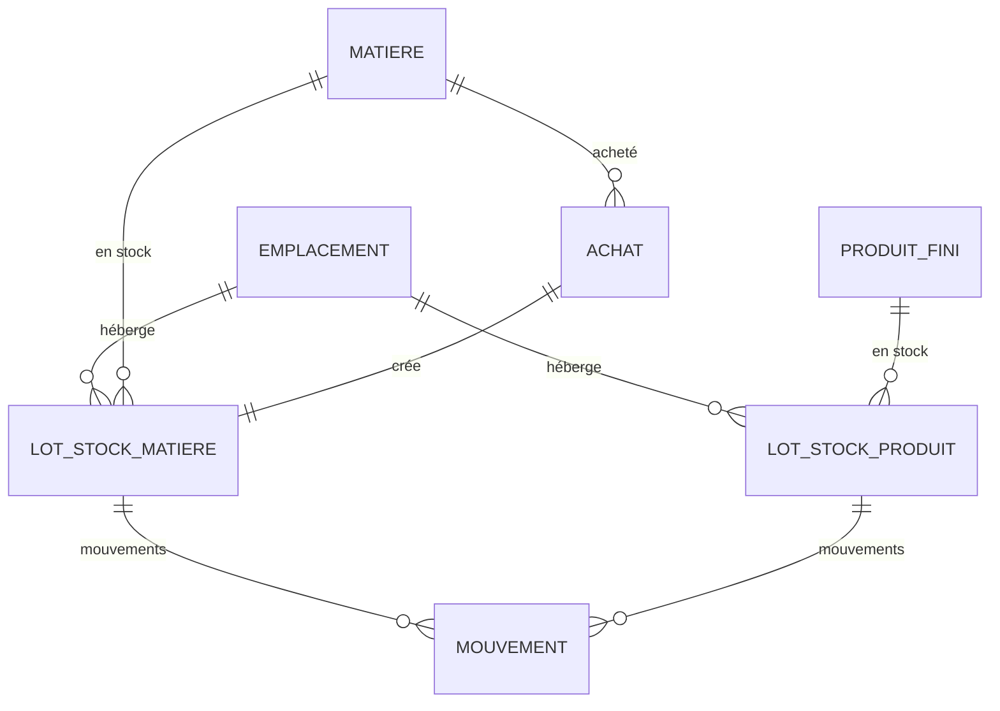

# Spec — Domaine D : Stock

Spec détaillée du **stock matières** (toutes provenances) et du **stock produits finis**, avec lots, DLUO, emplacements, achats et mouvements. Découle de [[00 - Cas d'utilisation]] (UC-D*) et **D7, D15, D17, D18**.

> **Stack** : Next.js 14 · Prisma/MySQL · API REST · webhooks — voir [[AI.md]].

---

## 1. Objet & périmètre

Suivre **ce qu’on a**, **où**, **jusqu’à quand** (DLUO), et **d’où ça vient** (récolte, achat, transformation, production) / **où ça part** (production, transformation, vente, casse).

| Flux | Entrée stock | Sortie stock |
|------|--------------|--------------|
| Matière fermière 🟢 | Récolte (E) | Transformation (C0), Production (C1) |
| Matière import 🟠 / base ⚪ | **Achat** (D) | Production (C1), éventuellement transformation |
| Produit fini | Production (C1) | Vente (B), ajustement |

**Dans le périmètre**
- Emplacements (select + créer)
- Lots matière & lots produit (quantité restante, DLUO, traçabilité source)
- Mouvements (ledger) + ajustements inventaire
- Achats (matières non fermières + éventuellement fermières achetées)
- Soldes / listes / alertes stock bas & DLUO proche
- Services appelables par E (récolte), C (transf./prod.), B (vente)

**Hors périmètre**
- Déclaration production / transformation (C) et vente (B) — D expose seulement les **services d’entrée/sortie**
- Conversion automatique frais→sec (D18 : via **transformation** C0)
- Intentions de vente (B) — l’alerte « vs intentions » consomme B quand disponible ; sinon seuil `stock_mini` seul
- Comptabilité (webhook achat / mouvement pour module externe)

---

## 2. Décisions de conception (Stock)

| # | Décision |
|---|----------|
| CD-1 | **Lots + mouvements.** Le stock visible = Σ quantités restantes des lots non épuisés. Chaque événement métier crée un **mouvement** et met à jour le(s) lot(s). Pas de « solde magique » sans historique. |
| CD-2 | **Frais / sec = matières distinctes** (aligné Catalogue : 0..n matières par espèce). Ex. « Thym frais » et « Thym séché ». **Aucune conversion auto** : le passage frais→sec = transformation C0 (sortie lot frais + entrée lot sec). L’UI peut *afficher* un équivalent indicatif via `ratio_sechage` (non stocké comme mouvement). |
| CD-3 | **Emplacement** : référentiel à **select + créer** (Q-D2). Ex. séchoir, bocaux, chambre froide, rayonnage, **n° de sac** (un sac peut être un emplacement nommé `Sac S-12`). |
| CD-4 | **DLUO / péremption par lot** (Q-D1 / D15) sur lots matière **et** lots produit. Alerte si `date_peremption − today ≤ seuil_jours_alerte_dluo` (paramètre, défaut 30). |
| CD-5 | **`stock_mini`** optionnel sur **Matière** et **ProduitFini** (tranche la question ouverte Catalogue). Alerte si solde &lt; seuil. |
| CD-6 | Alerte « stock produit vs intentions restantes » : **si** domaine B dispo, comparer solde aux intentions − ventes de l’année ; sinon se limiter à `stock_mini`. |
| CD-7 | **Achat** : crée lot matière + mouvement entrée + webhook `achat.declare` ; **option** d’ajouter une ligne `MatierePrix` (date = date achat, prix = prix unitaire). |
| CD-8 | Sortie en **FIFO par DLUO** (lots les plus proches de la péremption d’abord ; à DLUO égale, plus ancien `date_entree`). Surcharge manuelle possible (choix de lot). |
| CD-9 | **Transfert** d’emplacement = mouvement `transfert` (même lot ou split) sans changer la quantité totale matière/produit. |
| CD-10 | Unités : stock matière dans l’`unite_achat` de la matière (`kg`/`L`/`piece`) ; produit fini en **unités de vente** (pièces conditionnées). |
| CD-11 | Archivage emplacements sans mouvement récent OK ; refus si lots avec qty &gt; 0 (409). |

---

## 3. Modèle de données



### 3.1 Emplacement

- `id`, `nom` (unique, requis) — ex. `Chambre froide`, `Séchoir A`, `Sac S-12`
- `notes` (nullable)
- `archive` (bool), timestamps

### 3.2 Extensions Catalogue (champs ajoutés par D)

**Matiere** (+ existant A)
- `stock_mini` (nullable, même unité que `unite_achat`)

**ProduitFini** (+ existant A)
- `stock_mini` (nullable, en unités)

**Parametres** (+ existant A)
- `seuil_jours_alerte_dluo` (int, défaut 30)

### 3.3 LotStockMatiere

- `id`, `matiere_id`, `emplacement_id` (nullable au V1 si inconnu)
- `quantite_initiale`, `quantite_restante` (≥ 0 ; lot « fermé » si 0)
- `unite` (copie `matiere.unite_achat` à la création)
- `date_entree` (date), `date_peremption` (nullable)
- `numeros_sacs` (JSON liste, nullable — rappel traçabilité)
- `cout_unitaire` (nullable — prix d’achat ou coût estimé)
- `source_type` enum : `recolte` | `achat` | `transformation` | `ajustement` | `transfert`
- `source_id` (nullable — id de l’entité source)
- `recolte_id` (nullable FK logique Culture)
- `achat_id` (nullable)
- timestamps

### 3.4 LotStockProduit

- `id`, `produit_fini_id`, `emplacement_id?`
- `quantite_initiale`, `quantite_restante` (unités)
- `date_entree`, `date_peremption` / DLUO (nullable mais **recommandée** — D15)
- `numero_lot_production` (texte, nullable — lien C)
- `source_type` : `production` | `ajustement` | `transfert`
- `source_id?`, `production_id?`
- timestamps

### 3.5 Mouvement

Ledger unique (discriminé) :

- `id`, `date`, `sens` enum : `entree` | `sortie` | `ajustement` | `transfert`
- `cible` enum : `matiere` | `produit`
- `lot_matiere_id?`, `lot_produit_id?` (un des deux requis selon `cible`)
- `quantite` (&gt; 0) — toujours positive ; le `sens` donne la direction
- `emplacement_id?` (après coup pour transfert)
- `motif` (texte — requis si `ajustement`)
- `operateur_id` / `operateur_nom`
- `ref_type` / `ref_id` (recolte, achat, production, transformation, vente, manuel…)
- timestamps

### 3.6 Achat

- `id`, `matiere_id` (import ou base ; fermière achetée autorisée si besoin)
- `date`, `quantite`, `prix_unitaire`, `devise` (défaut EUR)
- `fournisseur` (texte V1 — pas de référentiel fournisseurs dédié)
- `lien?`, `emplacement_id?`, `date_peremption?`
- `ajouter_prix_catalogue` (bool, défaut true) → POST équivalent `MatierePrix`
- `lot_stock_matiere_id` (créé)
- `operateur_*`, timestamps

---

## 4. Règles métier & services

### 4.1 Soldes

```
solde_matiere(m)  = Σ lot.quantite_restante WHERE matiere_id = m AND quantite_restante > 0
solde_produit(p)  = Σ lot.quantite_restante WHERE produit_fini_id = p AND quantite_restante > 0
```

Filtres UI : par provenance, emplacement, DLUO, « sans prix » / « sous mini ».

### 4.2 Services (appelés par autres domaines)

```ts
// Depuis Culture (récolte)
entrerMatiereDepuisRecolte({ matiereId, quantite, date, emplacementId?, datePeremption?, numerosSacs?, recolteId, operateur })
  → LotStockMatiere + Mouvement entree ; retourne lot.id (→ Recolte.stock_mouvement_id / lot id)

// Depuis D (UI ou API)
entrerMatiereDepuisAchat(achatInput) → Achat + lot + mouvement [+ MatierePrix]

// Depuis C0 transformation
sortirMatiere({ matiereId, quantite, lotIds?, transformationId, ... })  // FIFO DLUO si lotIds omis
entrerMatiereDepuisTransformation({ matiereIdSortie, quantite, ... })

// Depuis C1 production
sortirMatieresPourProduction(lignes[])  // multi-matières
entrerProduitDepuisProduction({ produitFiniId, quantiteUnites, dluo?, numeroLotProduction, productionId, ... })

// Depuis B vente
sortirProduitPourVente({ produitFiniId, quantiteUnites, venteId, lotIds? })

// Manuel
ajusterLot({ cible, lotId, nouvelleQuantiteRestante | delta, motif, operateur })
transfererLot({ cible, lotId, emplacementDestId, quantite? })  // quantite omise = tout le lot
```

Quantité insuffisante → **409** `{ code: "STOCK_INSUFFISANT", details: { matiereId|produitId, demande, disponible, lots[] } }`.

### 4.3 FIFO DLUO (CD-8)

Pour une sortie sans `lotIds` :
1. Lots de la matière/produit avec `quantite_restante > 0`
2. Tri : `date_peremption ASC NULLS LAST`, puis `date_entree ASC`
3. Consommer jusqu’à couverture ; split multi-lots → N mouvements `sortie`

### 4.4 Alertes

| Alerte | Condition |
|--------|-----------|
| `matiere_sous_mini` | `solde < matiere.stock_mini` (si défini) |
| `produit_sous_mini` | idem produit |
| `dluo_proche` | lot avec `date_peremption` dans ≤ `seuil_jours_alerte_dluo` et qty &gt; 0 |
| `dluo_depassee` | `date_peremption < today` et qty &gt; 0 |
| `produit_vs_intention` | si B dispo : `solde < intention_restante` (année) |

Endpoint agrégé `GET /stock/alertes`.

### 4.5 Équivalent frais/sec (affichage seul)

Si matière A a `ratio_sechage` et qu’on affiche le solde de A (frais) : `equiv_sec = solde_frais × ratio_sechage`. **Ne crée pas** de stock sec.

---

## 5. Écrans (back-office)

Menu **Stock**.

- **Matières** — solde par matière (filtre provenance), drill-down lots (qty, DLUO, emplacement, source), bouton **Achat**, **Ajuster**, **Transférer**.
- **Produits finis** — solde unités, lots (n° lot prod., DLUO), ajuster / transférer.
- **Emplacements** — CRUD select+créer (réutilisé dans formulaires récolte / achat / prod.).
- **Achats** — historique filtrable ; détail → lot créé.
- **Mouvements** — journal global filtrable (période, matière/produit, type).
- **Alertes** — bandeau / page (mini, DLUO, intentions si B).

---

## 6. API REST

| Ressource | Méthodes |
|---|---|
| `/emplacements` | GET, POST, GET/PUT `:id`, DELETE → archive |
| `/stock/matieres` | GET (soldes + filtres) |
| `/stock/matieres/:matiereId/lots` | GET |
| `/stock/produits` | GET |
| `/stock/produits/:produitId/lots` | GET |
| `/stock/mouvements` | GET (filtres) |
| `/stock/alertes` | GET |
| `/achats` | GET, POST, GET `:id` |
| `/stock/lots-matiere/:id/ajuster` | POST `{ delta \| quantite_restante, motif }` |
| `/stock/lots-produit/:id/ajuster` | POST idem |
| `/stock/lots-matiere/:id/transferer` | POST `{ emplacement_id, quantite? }` |
| `/stock/lots-produit/:id/transferer` | POST idem |

Les entrées/sorties métier (récolte, prod., vente) passent par les **services** ; routes dédiées optionnelles pour debug/admin.

Erreurs : `{ code, message, details? }` ; stock insuffisant / intégrité → **409**.

---

## 7. Invariants

1. `quantite_restante ≥ 0` ; jamais de lot négatif.
2. Σ mouvements cohérente avec `quantite_initiale − sorties + ajustements` (test d’invariant).
3. Sortie ≤ disponible (409 sinon).
4. `emplacement.nom` unique ; archivage bloqué si lots qty &gt; 0.
5. Achat : `quantite > 0`, `prix_unitaire ≥ 0`.
6. Lien traçabilité : `recolte_id` / `production_id` / `achat_id` conservés sur le lot.

---

## 8. Webhooks

| Événement | Déclencheur | Payload (clés) |
|---|---|---|
| `stock.mouvement` | tout mouvement | `id, sens, cible, lot_id, quantite, ref_type, ref_id, date` |
| `achat.declare` | nouvel achat | `id, matiere_id, quantite, prix_unitaire, fournisseur, date, lot_id` |
| `stock.alerte` | (optionnel V1) passage sous mini / DLUO | `type, cible_id, solde, seuil` |

Payloads versionnés ; registre G.

---

## 9. Points d’ancrage autres domaines

| Domaine | Contrat |
|---------|---------|
| **E Culture** | `entrerMatiereDepuisRecolte` ; `Recolte.emplacement` → `emplacement_id` ; `numeros_sacs` copiés sur le lot |
| **C Transformation** | sortie matière entrante + entrée matière sortante (lots liés) |
| **C Production** | sorties multi-matières + entrée lot produit (DLUO, n° lot) |
| **B Vente** | `sortirProduitPourVente` |
| **A Catalogue** | `stock_mini`, `ratio_sechage` (affichage), `MatierePrix` via achat |

---

## 10. Découpage plans (indicatif)

1. **D1** — Emplacements + schéma lots/mouvements + soldes lecture
2. **D2** — Achats + entrée matière + webhook
3. **D3** — Services récolte (branche E) + ajustements + transferts
4. **D4** — Lots produit + services production/vente (stubs C/B) + FIFO DLUO
5. **D5** — Alertes (`stock_mini`, DLUO) + écrans back-office

---

## 11. Hors périmètre / ouvertures

- Référentiel **fournisseurs** dédié → hors V1 (texte sur achat).
- Valorisation stock comptable (CUMP, etc.) → hors V1 ; `cout_unitaire` sur lot suffit pour plus tard.
- Réservation de stock pour intentions → domaine F/B plus tard.
- Sac comme emplacement **ou** simple label `numeros_sacs` : les deux coexistent (CD-3) ; pas d’obligation de créer un emplacement par sac.

---

## Liens

- [[00 - Cas d'utilisation]] · [[01 - Décisions & questions ouvertes]] · [[A - Catalogue (spec)]] · [[E - Culture (spec)]]
