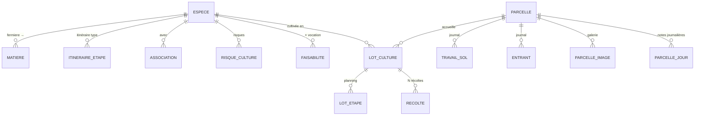

# Spec — Domaine E : Culture

Spec détaillée du domaine **Culture** : **parcelles** (seule entité terrain), espèces & itinéraires, lots de culture, planning **au jour près** (cascade), récoltes. Découle de [[00 - Cas d'utilisation]] (UC-E*) et des décisions **D4, D6, D14, D15, D16** ; précise D2 pour la Culture (voir CE-2).

> **Stack** : Next.js 14 · Prisma/MySQL · API REST · webhooks — voir [[AI.md]] et [[02 - Guide technique pour développeurs]].

---

## 1. Objet & périmètre

Permettre de **déclarer le terrain** (entité unique **Parcelle**), **référencer les espèces cultivées** (données culturales + itinéraires), **planifier les lots au jour près** avec cascade avant/arrière, et **déclarer les récoltes** (y compris **plusieurs récoltes par lot**) qui alimentent le stock matière fermière.

Reprend la logique des notes Obsidian *Planning Culture* (les « espaces » deviennent des **vocations** de parcelle) et des fiches *Plantes Aromatiques* (ex. [[Thym]]), ainsi que les onglets Excel `Planning Culture` / `Calendrier culture` / `Besoins plantes`.

**Dans le périmètre**
- Parcelles — **seule** entité de terrain (pas d’Espace, pas de planche/bloc) : code, surface, vocation, sol, journals, images, historique journalier
- Espèces (données culturales, itinéraire, associations, risques, faisabilité par vocation)
- Lots de culture + planning journalier + cascade + conflits
- Récoltes (N par lot ; lien traçabilité ; *effet stock* délégué au domaine D)

**Hors périmètre de cette spec**
- Stock matière (domaine D) — la récolte *appelle* une entrée stock, sans la modéliser ici
- Transformation frais→sec (domaine C0)
- Moteur de proposition automatique intentions→surfaces (domaine F)
- Alertes d’associations automatiques (Q-E8 : données oui, moteur plus tard)
- Arbitrage budget eau automatique (Q-E9 : affichage/filtre oui, moteur plus tard)
- SIG / géométrie parcelle (Q-E5)

---

## 2. Décisions de conception (Culture)

| # | Décision |
|---|----------|
| CE-1 | **Une seule entité terrain : Parcelle** (D16). Pas d’Espace, pas de planche/bloc. Les « espaces » Obsidian (serre semis, tunnel, frais, maraîchage, drainé ensoleillé, grande culture) = valeurs de l’enum **`vocation`** sur Parcelle. |
| CE-2 | **Tout en jours** (précise D2 pour la Culture). Unité de temps = **date civile** (`YYYY-MM-DD`) et **durées en jours entiers**. Pas de modèle « semaine 1…52 » en stockage ni en UI planning Culture. (D2 reste valable pour le raisonnement année civile ; la maille Culture est le **jour**.) |
| CE-3 | **Itinéraire type sur Espèce**, **copie ajustable sur Lot** (D4). Modifier l’itinéraire espèce **ne recalcule pas** les lots déjà créés (sauf action explicite « réappliquer l’itinéraire »). |
| CE-4 | **Cascade** : toute étape non `verrouillee` et non `decouplee` se décale avec ses voisines (avant ou arrière). Une étape `verrouillee` fixe sa date ; une étape `decouplee` ignore la cascade (dates libres). |
| CE-5 | **Durées d’itinéraire en jours** (entier ≥ 0) entre étapes consécutives. Planning = calendrier / timeline **au jour près** (vues mois ou année zoomables — pas de grille S1–S52). |
| CE-6 | **Historique journalier parcelle** = **vue dérivée** (occupations des lots + travail du sol / entrants du jour) + notes libres optionnelles `ParcelleJour`. Pas de double saisie obligatoire. |
| CE-7 | **Récolte** crée un événement métier ; l’**entrée en stock matière (frais)** est une **dépendance** vers le service Stock (D). Si Stock n’est pas encore livré : persister la récolte + émettre le webhook ; brancher le restock dès D. |
| CE-8 | **Faisabilité espèce × vocation** (🟢🟡🔴) stockée en table dédiée — alimente plus tard le domaine F ; consultable dès V1 Culture. |
| CE-9 | **Associations & risques** = données V1 (CRUD) ; pas d’alertes auto sur le planning (Q-E8). |
| CE-10 | **Images parcelle** : annotation **côté client avant upload** ; serveur stocke le fichier tel quel sous `uploads/parcelles/{parcelle_id}/` (disque persistant Hostinger). Métadonnées en base (légende, ordre). |
| CE-11 | **Archivage** (jamais de suppression dure) pour Parcelle, Espèce, Lot référencés. |
| CE-12 | Formulaire de récolte : `matiere_id` **requis** (matière fermière de l’espèce) pour lever l’ambiguïté frais/sec. |
| CE-13 | **Multi-récoltes par lot** autorisées (ex. coupes successives de thym) : N enregistrements `Recolte` pour un même `lot_id`. |

---

## 3. Modèle de données

### 3.1 Parcelle

- `id` (PK), `code` (unique, regex **`^[A-Z]+-[0-9]{2,3}$`** — D6)
- `surface_m2` (decimal > 0)
- `vocation` enum : `serre_semis` | `tunnel` | `frais` | `maraichage` | `draine_ensoleille` | `grande_culture` | `autre`
- **Sol** : `type_sol`, `ph` (nullable), `drainage` enum (`faible`/`modere`/`bon`), `pierrosite`, `exposition`, `pente` (textes ou enums souples)
- **Culture** : `particularites` (texte : ce qui pousse bien/mal, ombre, vent, gel…)
- `archivee` (bool), timestamps

### 3.2 Journals parcelle (traçabilité D15)

**TravailSol**
- `id`, `parcelle_id`, `date`, `type` (labour, faux-semis, paillage, couvert, autre…), `description`, `operateur_id` (nullable V1 si auth pas encore là)

**Entrant**
- `id`, `parcelle_id`, `date`
- `type` enum : `compost` | `amendement` | `fertilisation` | `phyto` | `irrigation` | `semence_plant` | `autre`
- `produit` (libellé), `quantite`, `unite`
- `ref_gaine` (nullable — irrigation), `ref_semence_plant` (nullable)
- `operateur_id` (nullable)

**ParcelleImage**
- `id`, `parcelle_id`, `chemin_fichier`, `legende`, `ordre`, `uploaded_at`

**ParcelleJour** (notes libres optionnelles)
- `(parcelle_id, date)` PK composite, `notes` (texte)

### 3.3 Espèce

- `id`, `nom` (unique), `nom_latin`, `famille`
- `cycle` enum : `annuelle` | `bisannuelle` | `vivace`
- `renouvellement_ans` (nullable — ex. thym 5–8)
- `ph_min`, `ph_max`, `type_sol`, `exposition`
- **Timing** (jours) : `temps_levee_min`, `temps_levee_max`, `temps_avant_repiquage` (levée→plantation)
- **Eau** : `besoin_eau` enum `faible`/`modere`/`eleve` (qualitatif, aligné matière) ; `besoin_eau_L_jour` (nullable), `besoin_eau_L_mois` (nullable)
- **Densité / rendement** : `espacement_cm`, `densite_plants_ha`, `rendement_t_ha_frais`, `rendement_kg_ha_sec`, `amendement_notes`
- `archivee`, timestamps

> Lien Catalogue : une **Matière** `provenance = fermiere` référence `espece_id` (déjà dans [[A - Catalogue (spec)]]). Une espèce peut avoir 0..n matières (frais, sec…).

### 3.4 Itinéraire type (sur Espèce)

**ItineraireEtape**
- `id`, `espece_id`, `ordre` (1..n unique par espèce)
- `code` enum libre étendu : `semis` | `plantation` | `recolte` | `taille` | `division` | `autre` (+ `libelle` si `autre`)
- `duree_depuis_precedente_jours` (entier ≥ 0 ; **0** pour la 1ʳᵉ étape)
- `fenetre_debut_mmdd`, `fenetre_fin_mmdd` (nullable, format `MM-DD` récurrent chaque année) — saisonnalité indicative en **jours de calendrier**
- `description` (nullable)

### 3.5 Associations, risques, faisabilité

**Association**
- `id`, `espece_id`, `espece_cible_id`, `type` enum `favorable` | `deconseillee`, `notes`

**RisqueCulture**
- `id`, `espece_id`, `nom`, `description`, `prevention`

**Faisabilite**
- `espece_id` + `vocation` (PK), `niveau` enum `vert` | `jaune` | `rouge`, `notes`
- Correspond à la matrice Obsidian Planning Culture (🟢🟡🔴).

### 3.6 Lot de culture

**LotCulture**
- `id`, `espece_id`, `parcelle_id`, `annee` (année civile)
- `surface_m2` (≤ surface parcelle — contrôlé à la création/maj et aux conflits)
- `priorite` enum `P1` | `P2` | `P3`
- **Overrides annuels** (Q-E7) : `rendement_t_ha_frais_reel` (nullable), `rendement_kg_ha_sec_reel` (nullable), `notes`
- `etat` enum : `prevu` | `seme` | `plante` | `en_croissance` | `en_recolte` | `termine` | `abandonne`
- `archive`, timestamps

**LotEtape** (instance planning)
- `id`, `lot_id`, `ordre`, `code` / `libelle` (copiés depuis l’itinéraire à la création)
- `date_prevue` (date)
- `duree_depuis_precedente_jours` (copie, **modifiable** sur le lot)
- `verrouillee` (bool, défaut false)
- `decouplee` (bool, défaut false)
- `date_reelle` (nullable — saisie à l’exécution)
- `fait` (bool)

À la **création du lot** : on copie toutes les `ItineraireEtape` de l’espèce en `LotEtape`, on calcule les `date_prevue` à partir d’une **date d’ancrage** fournie (souvent la 1ʳᵉ étape) + durées cumulées.

### 3.7 Récolte

**Recolte**
- `id`, `lot_id`, `date`
- `quantite_kg_frais` (> 0)
- `qualite` enum `A` | `B` | `C` | `autre` (+ `qualite_notes`)
- `numeros_sacs` (texte ou JSON liste — ex. `["S-12","S-13"]`)
- `emplacement` (libellé libre V1 ; quand D livré → FK emplacement stock select+créer)
- `date_peremption` (nullable)
- `operateur_id` / `operateur_nom` (D14)
- `stock_mouvement_id` (nullable — rempli quand D enregistre l’entrée)
- timestamps

---

## 4. Règles métier clés

### 4.1 Cascade avant (UC-E3.3)

Entrée : modification de `date_prevue` de l’étape *k* (ou de sa durée vers *k+1*).

Pour chaque étape *i > k* dans l’ordre :
- si `decouplee` → ignorer (ne pas déplacer, ne pas propager *via* elle : la suivante se calcule depuis la dernière étape non découplée amont) ;
- si `verrouillee` → **stop** la propagation vers l’aval (étapes suivantes inchangées) ;
- sinon `date_prevue_i = date_prevue_(prédécesseur non découplé) + duree_depuis_precedente_jours_i`.

### 4.2 Cascade arrière (UC-E3.4)

Entrée : modification de `date_prevue` de l’étape *k* (cible aval).

Pour chaque étape *i < k* en remontant :
- mêmes règles `decouplee` / `verrouillee` ;
- `date_prevue_i = date_prevue_(successeur) − duree_depuis_precedente_jours_(successeur)`.

### 4.3 Conflits (UC-E3.6)

Détectés à la validation (création/maj lot ou déplacement d’étape), renvoyés en **409** ou en payload d’avertissement selon sévérité :

| Conflit | Sévérité V1 | Règle |
|---------|-------------|--------|
| Deux lots **actifs** sur la même parcelle avec plages d’occupation qui se chevauchent | **erreur** (409) si surfaces cumulées > `parcelle.surface_m2` ; sinon **avertissement** | Occupation = de la 1ʳᵉ à la dernière `LotEtape.date_prevue` non terminée |
| `lot.surface_m2` > `parcelle.surface_m2` | **erreur** | |
| Étape hors fenêtre calendaire espèce | **avertissement** | `fenetre_debut_mmdd` / `fenetre_fin_mmdd` vs jour de `date_prevue` |
| Association `deconseillee` avec lot voisin même parcelle / période | **info** (pas bloquant — Q-E8) | |

> Bandes intercalaires / multi-espèces sur une même parcelle : **autorisées** tant que Σ `surface_m2` des lots actifs dont les plages se chevauchent ≤ `parcelle.surface_m2`. Conflit **dur** (409) uniquement en cas de dépassement.

### 4.4 État d’avancement du lot (UC-E4.4)

Heuristique V1 (surchargeable manuellement via `etat`) :
- aucune étape `fait` → `prevu`
- étape `semis` faite, pas encore `plantation` → `seme`
- `plantation` faite → `plante` puis `en_croissance`
- au moins une `recolte` faite et lot non clos → `en_recolte`
- toutes étapes faites ou clôture manuelle → `termine`

### 4.5 Récolte → stock (CE-7)

1. Persister `Recolte`.
2. Appeler `stock.entrerMatiereFerme({ matiereId, quantiteKg, lotRecolteId, emplacement, dluo, sacs })` quand le domaine D existe.
3. Émettre webhook `recolte.declaree`.
4. Résoudre la matière : matière `fermiere` liée à `lot.espece` en état **frais** (convention : une matière « X frais » par espèce, ou champ `etat_physique` sur matière — **à aligner avec D** ; en attendant, `matiere_id` peut être passé explicitement à la déclaration de récolte).

> **CE-12** : `matiere_id` requis à la déclaration. **CE-13** : plusieurs `Recolte` par lot sont normales (pas d’unicité lot+date imposée ; doublon exact même jour+quantité = avertissement UI seulement).

---

## 5. Écrans (back-office)

Menu latéral **Culture**.

- **Parcelles** — liste (filtre vocation, recherche code), fiche : caractéristiques, journals travail du sol / entrants, carrousel images (upload après annotation locale), vue **historique journalier** (calendrier année / mois), lots implantés. Aucune entité « espace » à gérer.
- **Espèces** — liste + fiche : données culturales (bloc type fiche Thym), itinéraire ordonné (CRUD étapes, durées en jours, fenêtres `MM-DD`), associations, risques, matrice faisabilité par vocation. Lien « matières liées » (Catalogue).
- **Lots & planning** — filtre année (ou plage de dates) ; **timeline / calendrier au jour près** (lignes = lots) avec pastilles d’étapes datées ; panneau lot (surface, priorité, overrides rendement, état) ; drag jour / saisie date → cascade ; cadenas (verrouiller) ; découpler.
- **Récoltes** — déclaration rapide depuis un lot (plusieurs fois si besoin) ; historique filtrable (période, espèce, parcelle, lot).
- **Conflits / alertes** — bandeau sur le planning (surfaces, fenêtres).

Recherche globale (UC-T1) : codes parcelle, noms d’espèces, n° lots.

---

## 6. API REST

Préfixe `/api`. Erreurs `{ code, message, details? }` ; intégrité → **409**.

| Ressource | Méthodes |
|---|---|
| `/parcelles` | GET, POST, GET/PUT `:id`, DELETE → archive |
| `/parcelles/:id/travaux-sol` | GET, POST |
| `/parcelles/:id/entrants` | GET, POST |
| `/parcelles/:id/images` | GET, POST (multipart), DELETE `:imageId` |
| `/parcelles/:id/historique` | GET `?from=&to=` → occupations + événements + notes **par jour** |
| `/parcelles/:id/jours/:date` | PUT notes (`date` = `YYYY-MM-DD`) |
| `/especes` | CRUD + archive |
| `/especes/:id/itineraire` | GET, PUT (remplace liste ordonnée ; durées en jours) |
| `/especes/:id/associations`, `/risques`, `/faisabilites` | CRUD sous-ressources |
| `/lots` | GET `?annee=&parcelle_id=&espece_id=`, POST, GET/PUT `:id`, DELETE → archive |
| `/lots/:id/etapes` | GET ; PATCH `:etapeId` (date, durées en jours, verrouillee, decouplee, fait) → **recalcule cascade** |
| `/lots/:id/reappliquer-itineraire` | POST (optionnel, destructif sur étapes non `fait`) |
| `/lots/:id/conflits` | GET |
| `/planning` | GET `?from=&to=` → agrégat lots + étapes (dates) pour le calendrier |
| `/recoltes` | GET, POST, GET `:id` |

### 6.1 Unité de temps

Toutes les durées et positions d’étapes sont en **jours** / **dates civiles**. Pas d’API « semaine » dans le domaine Culture.

---

## 7. Invariants d’intégrité

1. `parcelle.code` unique et conforme à D6.
2. `lot.surface_m2` ≤ `parcelle.surface_m2`.
3. `LotEtape` ordonnées sans trou d’`ordre` ; une seule étape `verrouillee` peut bloquer une direction de cascade.
4. Récolte : `lot_id` existant non archivé ; `matiere_id` = matière `fermiere` de l’espèce du lot.
5. Archivage parcelle/espèce refusée (409) si lots actifs non archivés.
6. Renommages / changements de code parcelle : liens par `id` uniquement.

---

## 8. Webhooks

| Événement | Déclencheur | Payload (clés) |
|---|---|---|
| `parcelle.creee` / `parcelle.maj` | CRUD parcelle | `id, code, vocation, surface_m2` |
| `lot.cree` / `lot.maj` / `lot.etat_change` | | `id, espece_id, parcelle_id, annee, etat, surface_m2` |
| `lot.planning_maj` | cascade / edit étape | `lot_id, etapes[{id,ordre,date_prevue}]` |
| `recolte.declaree` | nouvelle récolte | `id, lot_id, date, quantite_kg_frais, matiere_id, numeros_sacs, emplacement, date_peremption` |
| `parcelle.entrant_ajoute` | nouvel entrant | `parcelle_id, type, date, produit, quantite` |

Payloads versionnés (`version` + `type` + `data`), documentés avec le registre plateforme (G).

---

## 9. Découpage plans d’implémentation (indicatif)

1. **Plan E1** — Parcelles + journals + images + historique journalier (vue).
2. **Plan E2** — Espèces + itinéraires (jours) + associations/risques/faisabilité.
3. **Plan E3** — Lots + copie itinéraire + moteur de cascade (jours) + conflits + API planning.
4. **Plan E4** — Récoltes (multi) + webhook (+ stub/branchement stock D).
5. **Plan E5** — Écrans back-office (calendrier jour, fiches).

---

## 10. Hors périmètre V1 / questions ouvertes

- Alertes automatiques d’associations sur le planning (Q-E8) — plus tard.
- Arbitrage budget eau (Q-E9 / UC-F1.6) — affichage des besoins eau espèce OK ; moteur dans F.
- Proposition auto de planning depuis intentions (F).
- Emplacement récolte = FK Stock (D) — libellé texte en attendant.
- Une espèce sans matière fermière liée : autorisée (données culturales seules) ; récolte exige toutefois une matière (CE-12).
- Multi-récoltes par lot : **acté** (CE-13).
- Occupations multi-espèces sur une parcelle (bandes intercalaires) : **acté** — OK si surfaces cumulées ≤ parcelle.

---

## Liens

- [[00 - Cas d'utilisation]] · [[01 - Décisions & questions ouvertes]] · [[A - Catalogue (spec)]] · [[02 - Guide technique pour développeurs]]
- Vault : Planning Culture · fiches Plantes Aromatiques · Production PPAM
