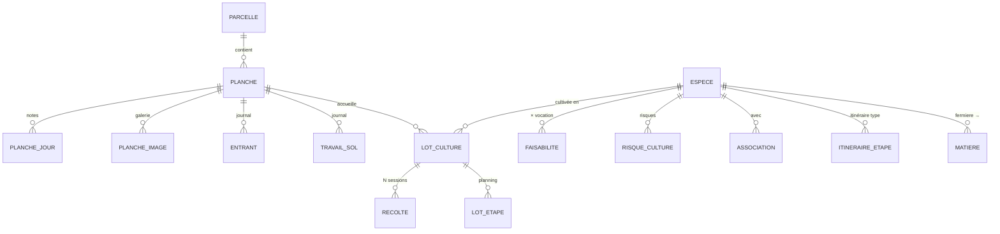

# Spec — Domaine E : Culture

Spec détaillée du domaine **Culture** : **Parcelle** (lettres) + **Planche** (numéros), espèces & itinéraires, lots, planning **au jour près** (cascade), récoltes. Découle de [[00 - Cas d'utilisation]] (UC-E*) et des décisions **D4, D6, D14, D15, D16** ; précise D2 pour la Culture (CE-2).

> **Stack** : Next.js 14 · Prisma/MySQL · API REST · webhooks — voir [[AI.md]] et [[02 - Guide technique pour développeurs]].

---

## 1. Objet & périmètre

Permettre de **déclarer le terrain** en deux niveaux (**Parcelle** = zone / lettres ; **Planche** = unité cultivée / numéros), **référencer les espèces**, **planifier les lots au jour près** avec cascade, et **déclarer les récoltes** — y compris **plusieurs sessions** sur un même lot (coupes successives **ou** récolte étalée / interrompue par la pluie).

Exemples de codes :
| Situation | Parcelle (lettres) | Planche (n°) | Code planche |
|-----------|-------------------|--------------|--------------|
| Champ | `GA` | `01` | `GA-01` |
| 1ʳᵉ planche du 1ᵉʳ tunnel de serre | `SA` | `01` | `SA-01` |
| Autre planche même tunnel | `SA` | `02` | `SA-02` |

Les « espaces » Obsidian (serre, tunnel, frais…) = **`vocation`** de la **Parcelle** (pas d’entité Espace).

**Dans le périmètre**
- Parcelles + Planches (journals, images, historique journalier sur la **planche**)
- Espèces (données culturales, itinéraire, associations, risques, faisabilité × vocation)
- Lots de culture (sur une **planche**) + planning journalier + cascade + conflits
- Récoltes multi-sessions (stock délégué à D)

**Hors périmètre**
- Stock matière (D) · Transformation C0 · Planification F · Alertes associations auto (Q-E8) · Budget eau auto (Q-E9) · SIG (Q-E5)

---

## 2. Décisions de conception (Culture)

| # | Décision |
|---|----------|
| CE-1 | **Deux entités terrain** : **Parcelle** = lettres (`^[A-Z]+$`, ex. `SA`, `GA`) ; **Planche** = numéros dans la parcelle (`[0-9]{2,3}`), code complet **`{lettres}-{numeros}`** (`SA-01`, `GA-01`) — D6. Pas d’entité « Espace ». La **planche** est l’unité opérationnelle (lots, journals, images, récoltes). |
| CE-2 | **Tout en jours** (précise D2). Dates `YYYY-MM-DD`, durées en jours entiers. Pas de maille « semaine 1…52 » en Culture. |
| CE-3 | **Itinéraire type sur Espèce**, **copie ajustable sur Lot** (D4). Changement d’itinéraire espèce ≠ recalcul auto des lots (sauf « réappliquer l’itinéraire »). |
| CE-4 | **Cascade** avant/arrière ; `verrouillee` fixe la date ; `decouplee` sort de la cascade. |
| CE-5 | Durées d’itinéraire en **jours**. UI = calendrier / timeline au jour près. |
| CE-6 | **Historique journalier** au niveau **Planche** (vue dérivée + notes `PlancheJour`). |
| CE-7 | Récolte → service Stock (D) + webhook `recolte.declaree` ; stub OK tant que D n’existe pas. |
| CE-8 | Faisabilité espèce × **vocation de parcelle** (🟢🟡🔴) en table. |
| CE-9 | Associations & risques = données V1 ; pas d’alertes auto (Q-E8). |
| CE-10 | Images **planche** : annotation client avant upload ; `uploads/planches/{planche_id}/`. |
| CE-11 | Archivage (pas de suppression dure) Parcelle, Planche, Espèce, Lot référencés. |
| CE-12 | Récolte : `matiere_id` **requis** (matière fermière de l’espèce). |
| CE-13 | **Multi-récoltes / multi-sessions** par lot : (a) coupes successives ; (b) **même vague** impossible en une journée ou **interrompue** (pluie…) puis reprise plus tard quand les plantes sont sèches. Chaque session = un enregistrement `Recolte` ; `campagne_id` optionnel pour regrouper les sessions d’une même vague. |

---

## 3. Modèle de données

### 3.1 Parcelle (zone — lettres)

- `id` (PK)
- `code` (unique, regex **`^[A-Z]+$`**, ex. `SA`, `GA`, `ZC`)
- `vocation` enum : `serre_semis` | `tunnel` | `frais` | `maraichage` | `draine_ensoleille` | `grande_culture` | `autre`
- **Sol / site** (attributs de zone) : `type_sol`, `ph`, `drainage`, `pierrosite`, `exposition`, `pente`
- `particularites` (texte zone)
- `surface_m2` (nullable — surface totale zone ; sinon dérivable Σ planches)
- `archivee`, timestamps

### 3.2 Planche (unité cultivée — numéros)

- `id` (PK)
- `parcelle_id` (FK)
- `numero` (string `[0-9]{2,3}`, unique **par parcelle** — ex. `01`, `123`)
- `code` (unique global, **dérivé** `{parcelle.code}-{numero}` — ex. `SA-01` ; stocké pour recherche / D6)
- `surface_m2` (decimal > 0) — surface de la planche
- `particularites` (nullable — contraintes propres à la planche)
- `archivee`, timestamps

> Création : choisir/créer la parcelle `SA`, saisir numéro `01` → code `SA-01`. Champ `GA-01` = parcelle `GA` + planche `01`.

### 3.3 Journals & médias (sur la **Planche**, traçabilité D15)

**TravailSol** — `id`, `planche_id`, `date`, `type`, `description`, `operateur_id?`

**Entrant** — `id`, `planche_id`, `date`, `type` (`compost`|`amendement`|`fertilisation`|`phyto`|`irrigation`|`semence_plant`|`autre`), `produit`, `quantite`, `unite`, `ref_gaine?`, `ref_semence_plant?`, `operateur_id?`

**PlancheImage** — `id`, `planche_id`, `chemin_fichier`, `legende`, `ordre`, `uploaded_at`

**PlancheJour** — `(planche_id, date)` PK, `notes`

### 3.4 Espèce

- `id`, `nom` (unique), `nom_latin`, `famille`
- `cycle` enum : `annuelle` | `bisannuelle` | `vivace`
- `renouvellement_ans` (nullable)
- `ph_min`, `ph_max`, `type_sol`, `exposition`
- **Timing** (jours) : `temps_levee_min`, `temps_levee_max`, `temps_avant_repiquage`
- **Eau** : `besoin_eau` (`faible`/`modere`/`eleve`) ; `besoin_eau_L_jour?`, `besoin_eau_L_mois?`
- **Densité / rendement** : `espacement_cm`, `densite_plants_ha`, `rendement_t_ha_frais`, `rendement_kg_ha_sec`, `amendement_notes`
- `archivee`, timestamps

> Catalogue : Matière `fermiere` → `espece_id`.

### 3.5 Itinéraire type (sur Espèce)

**ItineraireEtape**
- `id`, `espece_id`, `ordre`
- `code` : `semis` | `plantation` | `recolte` | `taille` | `division` | `autre` (+ `libelle`)
- `duree_depuis_precedente_jours` (≥ 0 ; 0 pour la 1ʳᵉ)
- `fenetre_debut_mmdd`, `fenetre_fin_mmdd` (nullable, `MM-DD`)
- `description?`

### 3.6 Associations, risques, faisabilité

**Association** — `espece_id`, `espece_cible_id`, `type` (`favorable`|`deconseillee`), `notes`

**RisqueCulture** — `espece_id`, `nom`, `description`, `prevention`

**Faisabilite** — `(espece_id, vocation)` → `niveau` (`vert`|`jaune`|`rouge`), `notes`  
*(vocation = celle de la **Parcelle** parente)*

### 3.7 Lot de culture

**LotCulture**
- `id`, `espece_id`, **`planche_id`**, `annee`
- `surface_m2` (≤ `planche.surface_m2`)
- `priorite` : `P1` | `P2` | `P3`
- Overrides annuels (Q-E7) : `rendement_t_ha_frais_reel?`, `rendement_kg_ha_sec_reel?`, `notes`
- `etat` : `prevu` | `seme` | `plante` | `en_croissance` | `en_recolte` | `termine` | `abandonne`
- `archive`, timestamps

**LotEtape** — copie de l’itinéraire + `date_prevue`, `duree_depuis_precedente_jours`, `verrouillee`, `decouplee`, `date_reelle?`, `fait`

### 3.8 Récolte (sessions)

**Recolte**
- `id`, `lot_id`, `date` (jour de la **session**)
- `quantite_kg_frais` (> 0) — quantité de **cette** session
- `qualite` : `A` | `B` | `C` | `autre` (+ `qualite_notes`)
- `numeros_sacs` (liste)
- `emplacement` (texte V1 ; FK Stock plus tard)
- `date_peremption?`
- `campagne_id` (nullable UUID) — **même vague** multi-jours (pluie, reprise quand plantes sèches…)
- `notes?` (ex. « interrompu pluie — reprise prévue »)
- `operateur_id` / `operateur_nom`
- `matiere_id` (requis, CE-12)
- `stock_mouvement_id?`
- timestamps

Quantité totale d’une vague = Σ des `Recolte` partageant le même `campagne_id` (ou Σ du lot si pas de campagne).

---

## 4. Règles métier clés

### 4.1–4.2 Cascade

Inchangées : décalage avant/arrière en **jours** selon `duree_depuis_precedente_jours`, respect `verrouillee` / `decouplee`.

### 4.3 Conflits (UC-E3.6)

| Conflit | Sévérité V1 | Règle |
|---------|-------------|--------|
| Lots actifs sur la **même planche**, plages qui se chevauchent | **409** si Σ surfaces > `planche.surface_m2` ; sinon avertissement | |
| `lot.surface_m2` > `planche.surface_m2` | **erreur** | |
| Étape hors fenêtre `MM-DD` | **avertissement** | |
| Association déconseillée (même planche / parcelle, période) | **info** | Q-E8 |

Bandes intercalaires sur une planche : OK si Σ surfaces ≤ planche.

### 4.4 État du lot

Heuristique inchangée (`prevu` → … → `en_recolte` dès qu’≥ 1 session `Recolte` existe).

### 4.5 Récolte → stock (CE-7 / CE-13)

1. Persister la **session** `Recolte` (éventuellement avec `campagne_id` pour lier à une vague en cours).
2. Entrée stock D pour **cette** quantité de session.
3. Webhook `recolte.declaree` (payload inclut `campagne_id` si présent).

Cas couverts :
- Coupes successives (thym) → N récoltes, campagnes distinctes ou sans campagne.
- Récolte trop longue pour un jour / **coupée par la pluie** → plusieurs sessions, **même `campagne_id`**, dates différentes.

---

## 5. Écrans (back-office)

Menu **Culture**.

- **Parcelles** — liste (code lettres, vocation) ; fiche zone + **liste des planches** ; créer une planche (`numero` → code auto).
- **Planches** — liste/filtre (code `SA-01`, parcelle, vocation) ; fiche : surface, particularités, journals, images, historique journalier, lots.
- **Espèces** — inchangé (itinéraire en jours, faisabilité × vocation).
- **Lots & planning** — timeline au jour près ; lot rattaché à une **planche** (affichage `SA-01` + vocation parcelle).
- **Récoltes** — déclaration session ; option « **continuer une vague** » (reprend `campagne_id`) ou « nouvelle vague » ; historique avec regroupement par campagne.

Recherche globale : codes parcelle (`SA`), codes planche (`SA-01`), espèces, lots.

---

## 6. API REST

| Ressource | Méthodes |
|---|---|
| `/parcelles` | GET, POST, GET/PUT `:id`, DELETE → archive |
| `/parcelles/:id/planches` | GET, POST |
| `/planches` | GET (filtre `parcelle_id`, `code`, vocation via join), GET/PUT `:id`, DELETE → archive |
| `/planches/:id/travaux-sol` | GET, POST |
| `/planches/:id/entrants` | GET, POST |
| `/planches/:id/images` | GET, POST multipart, DELETE |
| `/planches/:id/historique` | GET `?from=&to=` |
| `/planches/:id/jours/:date` | PUT notes |
| `/especes` (+ itinéraire, associations, risques, faisabilités) | CRUD |
| `/lots` | GET `?annee=&planche_id=&parcelle_id=&espece_id=`, POST, GET/PUT `:id`, archive |
| `/lots/:id/etapes` | GET ; PATCH → cascade |
| `/lots/:id/reappliquer-itineraire` | POST |
| `/lots/:id/conflits` | GET |
| `/planning` | GET `?from=&to=` |
| `/recoltes` | GET, POST (`campagne_id?`), GET `:id` |

### 6.1 Unité de temps

Jours / dates civiles uniquement.

---

## 7. Invariants d’intégrité

1. `parcelle.code` ∈ `^[A-Z]+$`, unique.
2. `planche.numero` ∈ `^[0-9]{2,3}$`, unique par `parcelle_id` ; `planche.code` = `{parcelle.code}-{numero}`, unique global (D6).
3. `lot.surface_m2` ≤ `planche.surface_m2` ; lot → planche non archivée.
4. Récolte : lot non archivé ; `matiere_id` fermière de l’espèce du lot.
5. Archiver une parcelle : 409 s’il reste des planches non archivées (ou cascade d’archivage explicite).
6. Archiver une planche : 409 si lots actifs.
7. Liens par `id` (renommage de code parcelle → recalcul des `planche.code` enfants dans la même transaction).

---

## 8. Webhooks

| Événement | Payload (clés) |
|---|---|
| `parcelle.creee` / `parcelle.maj` | `id, code, vocation` |
| `planche.creee` / `planche.maj` | `id, code, parcelle_id, numero, surface_m2` |
| `lot.cree` / `lot.maj` / `lot.etat_change` | `id, espece_id, planche_id, annee, etat, surface_m2` |
| `lot.planning_maj` | `lot_id, etapes[{id,ordre,date_prevue}]` |
| `recolte.declaree` | `id, lot_id, date, quantite_kg_frais, matiere_id, campagne_id?, numeros_sacs, emplacement, date_peremption` |
| `planche.entrant_ajoute` | `planche_id, type, date, produit, quantite` |

---

## 9. Découpage plans (indicatif)

1. **E1** — Parcelles + Planches + journals + images + historique journalier
2. **E2** — Espèces + itinéraires + associations/risques/faisabilité
3. **E3** — Lots (sur planche) + cascade + conflits + planning
4. **E4** — Récoltes multi-sessions / campagnes + webhook (+ stock D)
5. **E5** — Écrans back-office

---

## 10. Hors périmètre / ouvertures

- Alertes associations auto, budget eau auto, moteur F — plus tard.
- Emplacement récolte = FK Stock (D) plus tard.
- Espèce sans matière : OK ; récolte exige matière (CE-12).
- Traçabilité affichée : **Parcelle → Planche → Récolte → …** (D15 enrichi).

---

## Liens

- [[00 - Cas d'utilisation]] · [[01 - Décisions & questions ouvertes]] · [[A - Catalogue (spec)]] · [[02 - Guide technique pour développeurs]]
- Vault : Planning Culture · fiches Plantes Aromatiques · Production PPAM
