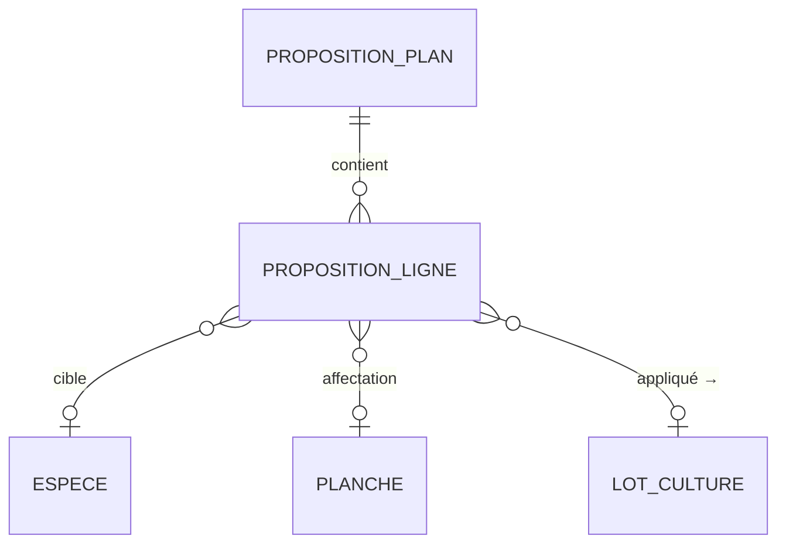

# Spec — Domaine F : Planification

Spec du **moteur d’aide à la décision** : proposer un planning de culture à partir des intentions (et carnet de commandes), du stock, des rendements et des planches disponibles. Découle de [[00 - Cas d'utilisation]] (UC-F*) ; agrège **B, D, E**.

> Arrive **en dernier** dans l’ordre de construction. Ne remplace pas la saisie manuelle des lots Culture : il **propose**, l’exploitant **valide / ajuste**.

---

## 1. Objet & périmètre

Chaîne de calcul :

```
Intentions (+ commandes confirmées)
  → besoins produits (unités)
  → besoins matière (kg sec / frais)
  → besoin net (= besoin − stock matière)
  → surfaces (m² = kg ÷ rendement espèce)
  → propositions d’affectation Planche (faisabilité 🟢🟡🔴)
  → (option) création / maj de Lots Culture
```

**Dans le périmètre V1**
- Générer une **PropositionPlan** pour une **année civile**
- Besoins dérivés (réutilise / étend `GET /besoins` de B)
- Déduction stock matière (D)
- Vivaces déjà en place (lots culture non terminés) → ne pas replacer
- Priorité P1/P2/P3 des intentions
- Affectation suggérée aux **planches** via matrice faisabilité espèce × vocation parcelle
- Besoin eau **affiché / filtrable** (Q-E9) — pas d’arbitrage auto budget
- Édition manuelle de la proposition + recalcul
- Comparaison planifié vs besoin (couverture / manques / surplus)
- Appliquer la proposition → crée/maj `LotCulture` (E) avec ancrage dates optionnel

**Hors périmètre V1**
- Arbitrage automatique budget eau (Q-E9)
- Alertes / suggestions d’associations automatiques (Q-E8 — données seulement)
- Scoring rotation multi-années avancé (voir CF-8)
- Ordonnancement charge de travail / équipements
- Optimisation globale (solveur ILP) — heuristique gloutonne suffit

---

## 2. Décisions de conception (Planification)

| # | Décision |
|---|----------|
| CF-1 | Une **PropositionPlan** = snapshot éditable pour `(annee)` ; versionnée (`v1`, `v2`…) ; une seule « active » à la fois (les autres = archives). |
| CF-2 | Entrées : intentions année + option `inclure_commandes` (carnet B) + soldes stock D + lots culture E existants. |
| CF-3 | Formules (alignées Excel `Besoins plantes`) : `kg_produit = unites × poids_unite` ; fraction recette → `kg_matiere` ; `besoin_net = max(0, besoin − stock)` ; `m2 = kg_net / rendement` (rendement en kg/m² dérivé de t/ha ou kg/ha sec). |
| CF-4 | Affectation : glouton par priorité P1→P3 puis kg restant ; préfère planches 🟢 puis 🟡 ; ignore 🔴 ; signale **non plaçable** si surface insuffisante. |
| CF-5 | Unité d’affectation = **Planche** (pas seulement Parcelle) ; surface disponible = `planche.surface_m2 − Σ lots actifs chevauchant l’année`. |
| CF-6 | Eau V1 : chaque ligne proposition expose `besoin_eau` espèce + estimation L ; filtres UI « faible eau » ; **pas** de budget contraignant auto. |
| CF-7 | Associations : pas d’alerte auto V1 ; éventuel badge info si données présentes (non bloquant). |
| CF-8 | **Pérennité / rotations (UC-F1.5)** — V1 : (a) **vivaces déjà implantées** couvrent le besoin sans nouvelle surface ; (b) historique planche **affiché** à l’affectation (info) ; **pas** de refus auto pour mauvaise rotation. Scoring rotation → plus tard. |
| CF-9 | « Appliquer » crée des `LotCulture` + copie itinéraire (cascade E) ; ne détruit pas les lots existants sans confirmation. |
| CF-10 | Recalcul : toute modif manuelle (surface, planche, kg) marque la ligne `manuelle` ; recalcul global préserve les lignes `manuelle` sauf force. |

---

## 3. Modèle de données



### 3.1 PropositionPlan

- `id`, `annee`, `version` (int)
- `statut` : `brouillon` | `active` | `appliquee` | `archivee`
- `inclure_commandes` (bool)
- `parametres` JSON (ex. `ignorer_stock`, `filtre_eau: faible|tous`)
- `notes?`, `created_by`, timestamps

### 3.2 PropositionLigne

- `id`, `proposition_id`
- `espece_id` (et/ou `matiere_id` sec de référence)
- `priorite` (max des intentions liées, P1–P3)
- `besoin_kg_brut`, `stock_kg`, `besoin_kg_net`
- `besoin_kg_frais_equiv?` (via ratio)
- `surface_m2_calculee`, `surface_m2` (ajustable)
- `planche_id?` (affectation)
- `faisabilite` : `vert` | `jaune` | `rouge` | `non_place`
- `besoin_eau` (enum espèce), `eau_L_estime?`
- `lot_culture_existant_id?` (vivace qui couvre)
- `lot_culture_cree_id?` (après apply)
- `manuelle` (bool, CF-10)
- `notes?`

Pas besoin de stocker toutes les intentions liées en table : recalculables ; option JSON `sources: [{intention_id, unites}]`.

### 3.3 Paramètres planif (singleton ou dans Parametres A)

- `budget_eau_m3_an?` (affiché seulement V1)
- `rendement_defaut` fallback si espèce sans rendement

---

## 4. Algorithme V1 (heuristique)

### 4.1 Calcul besoins

1. Charger intentions `annee` (+ commandes confirmées/préparées si flag).
2. Pour chaque produit : unités → kg via `poids_unite` → éclater recette → kg par matière fermière (et import si on cultive équivalent — V1 = matières `provenance=fermiere` liées espèce).
3. Agréger par `espece_id`.
4. Soustraire stock matière (toutes matières de l’espèce, ou matière « sec » préférée — configurable).
5. Vivaces : si lot culture `cycle=vivace` actif sur une planche couvrant l’espèce → réduire `besoin_kg_net` / marquer couverture partielle.

### 4.2 Surfaces

```
rendement_kg_m2 = rendement_kg_ha_sec / 10000   # ou frais selon cible
surface_m2 = besoin_kg_net / rendement_kg_m2
```
Si rendement absent → ligne `non_place` + motif `rendement_manquant`.

### 4.3 Affectation planches

Pour chaque espèce (ordre P1→P3, puis surface desc) :
1. Lister planches libres avec faisabilité ≠ rouge, tri 🟢 puis 🟡, puis surface dispo desc.
2. Allouer surface jusqu’à combler ; multi-planches OK (plusieurs `PropositionLigne` ou sous-lignes — V1 : **une ligne par couple espèce×planche**).
3. Reste → `non_place`.

### 4.4 Appliquer

Pour chaque ligne avec `planche_id` et `surface_m2 > 0` :
- Créer `LotCulture` (ou maj si `lot_culture_cree_id`) : espèce, planche, année, surface, priorité.
- Copier itinéraire ; date d’ancrage = paramètre user ou début de fenêtre semis.
- Statut proposition → `appliquee`.

---

## 5. Comparaison planifié vs besoin (UC-F1.4)

Vue / endpoint :

| Indicateur | Calcul |
|------------|--------|
| Besoin net kg | proposition |
| Planifié kg | Σ surface_m2 × rendement (lots créés + lignes) |
| Stock actuel | D |
| Écart | planifié + stock − besoin brut |
| Statut | `ok` / `manque` / `surplus` |

---

## 6. Écrans

Menu **Planification**.

- **Nouvelle proposition** — année, options (commandes, filtre eau), lancer calcul.
- **Éditeur** — tableau lignes (espèce, kg, m², planche, faisabilité, eau) ; edit inline ; recalcul ; non plaçables en rouge.
- **Carte / liste planches** — occupation proposée.
- **Couverture** — planifié vs besoin.
- **Appliquer** — confirmation + lien vers lots Culture créés.

---

## 7. API REST

| Ressource | Méthodes |
|---|---|
| `/planification/propositions` | GET, POST `{ annee, inclure_commandes, parametres }` → lance calcul |
| `/planification/propositions/:id` | GET, PUT (métadonnées), DELETE → archive |
| `/planification/propositions/:id/recalculer` | POST `{ forcer_manuelles?: bool }` |
| `/planification/propositions/:id/lignes/:ligneId` | PATCH (surface, planche_id, notes…) |
| `/planification/propositions/:id/appliquer` | POST |
| `/planification/propositions/:id/couverture` | GET |
| `/planification/besoins` | GET `?annee=` (délègue / étend B) |

---

## 8. Invariants

1. Une seule proposition `active` par année (ou zero).
2. `surface_m2` allouée ≤ surface planche disponible (409 sinon à l’apply).
3. Apply idempotent si déjà `appliquee` (ou 409).
4. Lignes `manuelle` préservées au recalcul sauf `forcer_manuelles`.

---

## 9. Webhooks

| Événement | Payload |
|---|---|
| `planification.proposee` | `id, annee, version, nb_lignes, nb_non_place` |
| `planification.appliquee` | `id, lot_culture_ids[]` |

---

## 10. Découpage plans (indicatif)

1. **F1** — Calcul besoins + surfaces (sans affectation) + API lecture
2. **F2** — Affectation planches + faisabilité + non plaçables
3. **F3** — Édition lignes + recalcul + couverture
4. **F4** — Appliquer → Lots Culture
5. **F5** — Écrans + filtre eau + vivaces

---

## 11. Hors périmètre / ouvertures

- Solveur optimal / contraintes dures rotation & eau.
- Suggestions compagnonnage auto (Q-E8).
- Multi-années dans une même proposition (D10 : année civile).

---

## Liens

- [[00 - Cas d'utilisation]] · [[01 - Décisions & questions ouvertes]] · [[B - Commercial (spec)]] · [[D - Stock (spec)]] · [[E - Culture (spec)]]
