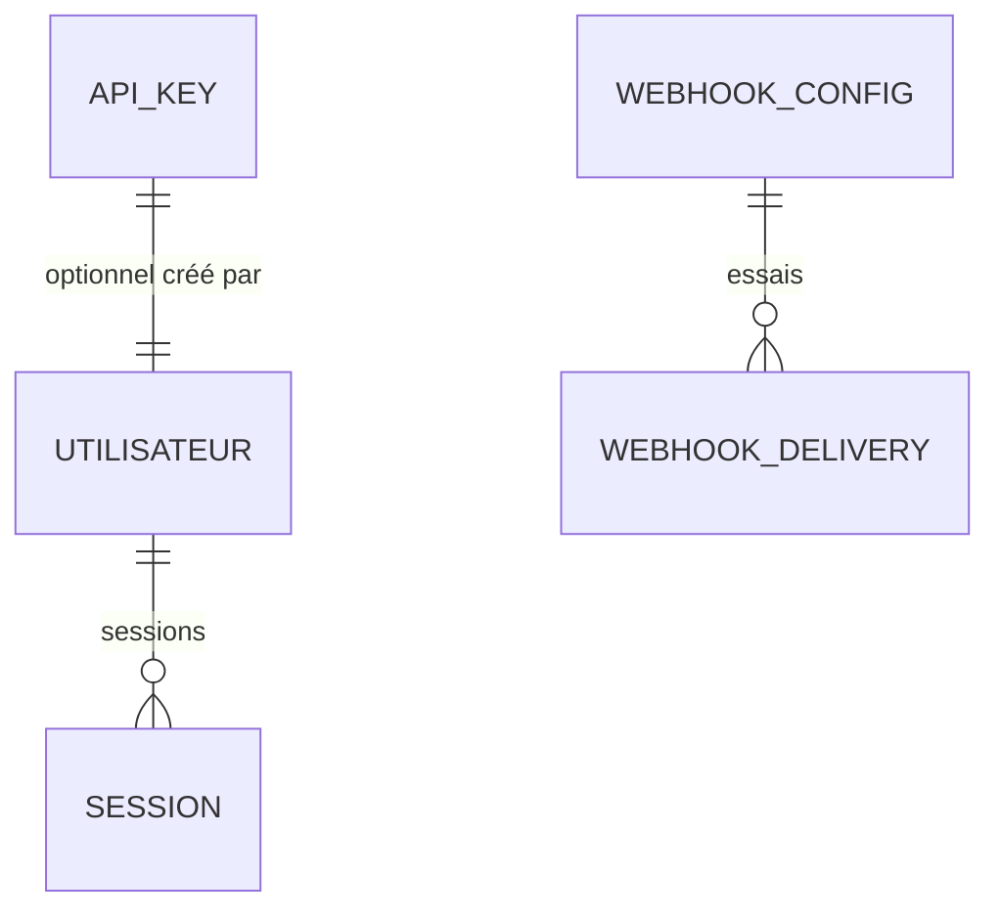

# Spec — Domaine G : Plateforme

Spec transverse : **conventions API REST**, **authentification**, **webhooks**, **storefront** interne, **uploads**, utilisateurs. Socle commun consommé par A–F. Découle de [[00 - Cas d'utilisation]] (UC-G*) et **D5, D8, D14, D17**.

> **Stack** : Next.js 14 App Router · TypeScript · Prisma/MySQL · Zod · Vitest · Hostinger (`PORT`, disque persistant).

---

## 1. Objet & périmètre

| Brique | Rôle V1 |
|--------|---------|
| API REST | Seul cœur métier ; back-office + storefront + intégrations |
| Auth | Login/mdp multi-utilisateur + clé d’API |
| Webhooks | Config JSON `événement → [urls]` ; payloads versionnés |
| Storefront | Front de **saisie vente rapide** (pas boutique publique) |
| Uploads | Images planches (etc.) sur disque local |
| Utilisateurs | Comptes opérateurs tracés (D14) |

**Hors périmètre V1**
- Boutique publique / paiement en ligne
- Module comptable (consommateur webhooks seulement)
- Retry/rejeu webhook sophistiqué (voir CG-6)
- Rôles/permissions fins (tous les users = même droits V1)
- OAuth / SSO

---

## 2. Décisions de conception (Plateforme)

| # | Décision |
|---|----------|
| CG-1 | **API-first** (D5) : aucune logique métier dans les pages UI ; tout passe par services + Route Handlers. |
| CG-2 | Erreurs normalisées `{ code, message, details? }` ; intégrité / conflit métier → **HTTP 409** ; validation → **400** ; auth → **401** ; interdit → **403** ; introuvable → **404**. |
| CG-3 | Listes : pagination `?page=&pageSize=` (défaut 50, max 200) ; réponse `{ data, meta: { page, pageSize, total } }`. |
| CG-4 | Auth **double** : (a) session cookie httpOnly après login/mdp ; (b) header `Authorization: Bearer <api_key>` pour intégrations. |
| CG-5 | Payload webhook : `{ version: 1, type: "<event>", occurred_at, data: { … } }`. Doc par événement dans registre. |
| CG-6 | Delivery V1 : POST JSON, timeout court (~5 s), **1 tentative** ; échec loggé (`WebhookDelivery`) ; **pas de retry auto** V1 (Q-G3). Rejeu manuel admin possible. |
| CG-7 | Config webhooks : fichier/table JSON éditable dans l’app (`WebhookConfig`) : map `event → url[]`. |
| CG-8 | Storefront = route(s) UI dédiées `/storefront` (ou `/vente`) : produit → qty → prix → PdV → valider → `POST /api/ventes`. |
| CG-9 | Uploads sous `UPLOAD_DIR` (env, défaut `public/uploads/`) ; MIME whitelist ; taille max 5 Mo (guide Hostinger). |
| CG-10 | Utilisateur : `email`/`login` unique, `password_hash`, `nom_affiche` (opérateur), `actif`. Pas de rôles V1. |
| CG-11 | Recherche globale (UC-T1) : endpoint unique `GET /api/search?q=` agrégeant domaines (implémentation progressive). |
| CG-12 | Health : `GET /api/health` → `{ status: "ok" }` (déjà Plan Catalogue 1). |

---

## 3. Modèle de données (plateforme)



### 3.1 Utilisateur

- `id`, `login` (unique), `email?` (unique si présent)
- `password_hash` (argon2/bcrypt)
- `nom_affiche` (utilisé comme `operateur_nom` par défaut)
- `actif` (bool), timestamps

### 3.2 ApiKey

- `id`, `nom` (libellé), `key_hash` (ne jamais stocker la clé claire après création)
- `prefix` (ex. `chd_…` affiché pour recognition)
- `actif`, `created_at`, `last_used_at?`
- À la création : renvoyer la clé **une seule fois**.

### 3.3 WebhookConfig

- Singleton / ligne JSON : `{ "vente.realisee": ["https://…"], … }`
- Ou table `WebhookSubscription` : `(event, url, actif)` — équivalent.

### 3.4 WebhookDelivery (log)

- `id`, `event`, `url`, `payload`, `status_code?`, `ok` (bool), `error?`, `created_at`

---

## 4. Conventions API

### 4.1 Préfixe & format

- Base : `/api/…`
- Content-Type : `application/json` (sauf multipart uploads)
- Dates : `YYYY-MM-DD` ou ISO-8601 datetime UTC

### 4.2 Auth sur chaque route métier

Middleware : accepter **session valide** OU **clé API active**.  
Exceptions publiques : `/api/health`, `/api/auth/login`.

### 4.3 Registre des événements webhook (V1)

| Événement | Domaine |
|-----------|---------|
| `matiere.creee`, `matiere.maj`, `matiere.prix_ajoute` | A |
| `recette.*`, `produit.*`, `conditionnement.maj` | A |
| `recolte.declaree` | E |
| `transformation.declaree`, `production.declaree` | C |
| `stock.mouvement`, `achat.declare` | D |
| `client.cree`, `client.maj` | B |
| `commande.confirmee`, `commande.livree`, `commande.annulee` | B |
| `vente.realisee`, `vente.annulee` | B |
| `intention.maj` | B |

Enrichi au fil des domaines ; la config JSON doit lister les clés connues (même avec `[]`).

### 4.4 Émission

```ts
await emit(event, data) // resolve urls → POST parallèle → log WebhookDelivery
```

Fire-and-forget côté requête HTTP métier (ne bloque pas le 2xx si webhook échoue) ; log systématique.

---

## 5. Auth & sessions

| Endpoint | Comportement |
|----------|--------------|
| `POST /api/auth/login` | `{ login, password }` → session cookie |
| `POST /api/auth/logout` | invalide session |
| `GET /api/auth/me` | utilisateur courant |
| `POST /api/api-keys` | crée une clé (réponse one-shot) |
| `GET /api/api-keys` | liste (prefix, nom, last_used) |
| `DELETE /api/api-keys/:id` | révoque |

Opérateur : `nom_affiche` injecté automatiquement dans les écritures métier si non fourni.

---

## 6. Storefront (D8)

**But** : saisie ultra-rapide au marché / à la ferme.

**Flux UI**
1. Choisir **point de vente** (mémorisé localStorage pour la session journée)
2. Chercher / picker **produit** (actifs seulement)
3. Quantité, prix (prérempli catalogue), notes optionnelles, client optionnel
4. Valider → `POST /api/ventes` → feedback OK / erreur stock 409
5. Historique court de la journée (mêmes filtres date + PdV)

Pas de panier multi-lignes obligatoire V1 (enchaîner les validations). Pas de paiement.

Routes UI : `/storefront` (layout minimal, gros boutons, mobile-friendly).

---

## 7. Uploads

- `POST /api/uploads` ou endpoints domaine (`/planches/:id/images`)
- Stockage : `{UPLOAD_DIR}/{domaine}/{id}/{uuid}.ext`
- Servir via `/uploads/…` (static) ou handler signé simple
- Annotation images : **côté client avant upload** (Culture CE-10)

---

## 8. Écrans plateforme (back-office)

- **Utilisateurs** — CRUD comptes (actif/inactif), pas de self-service mdp oublié V1 (reset admin)
- **Clés API** — créer / révoquer
- **Webhooks** — éditeur JSON ou liste event→urls ; journal des deliveries (filtre échecs)
- Accès storefront depuis le menu (raccourci)

---

## 9. API REST (plateforme)

| Ressource | Méthodes |
|---|---|
| `/health` | GET |
| `/auth/login`, `/auth/logout`, `/auth/me` | POST / GET |
| `/utilisateurs` | CRUD (admin = tout user V1) |
| `/api-keys` | GET, POST, DELETE `:id` |
| `/webhooks/config` | GET, PUT |
| `/webhooks/deliveries` | GET (filtres) |
| `/webhooks/deliveries/:id/rejouer` | POST (manuel) |
| `/search` | GET `?q=` |

---

## 10. Découpage plans (indicatif)

1. **G1** — Auth login/session + Utilisateurs + opérateur tracé
2. **G2** — Clés API + middleware auth unifié
3. **G3** — Webhooks emit + config + log deliveries (+ rejeu manuel)
4. **G4** — Storefront UI vente rapide
5. **G5** — Uploads génériques + recherche globale (peut suivre les domaines)

> Le Plan Catalogue 5 (auth + doc webhooks) est **absorbé** par G1–G3.

---

## 11. Hors périmètre / ouvertures

- Retry exponentiel / DLQ webhooks → plus tard.
- Permissions par rôle → plus tard.
- OpenAPI générée / Swagger UI → souhaitable dès G3 (doc contrats).
- Rate limiting clé API → plus tard si abus.

---

## Liens

- [[00 - Cas d'utilisation]] · [[01 - Décisions & questions ouvertes]] · [[02 - Guide technique pour développeurs]] · [[AI.md]]
- Domaines : [[A - Catalogue (spec)]] · [[B - Commercial (spec)]] · [[C - Production & transformation (spec)]] · [[D - Stock (spec)]] · [[E - Culture (spec)]]
